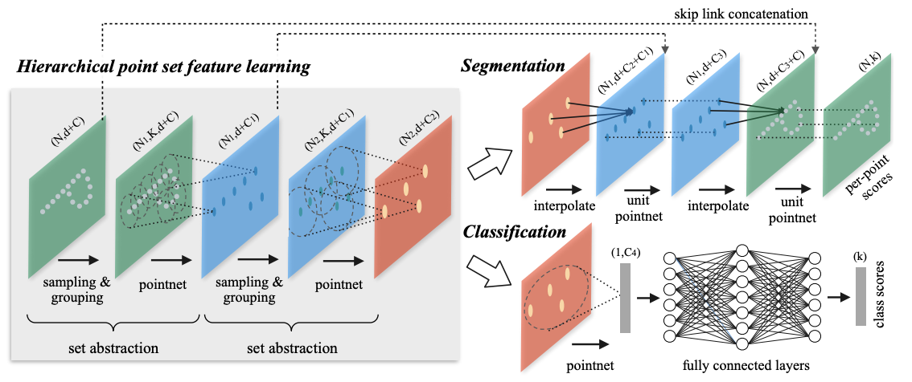
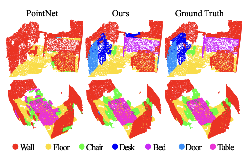
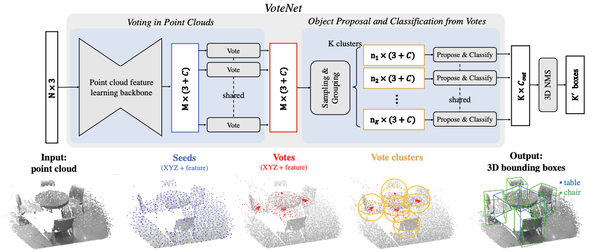
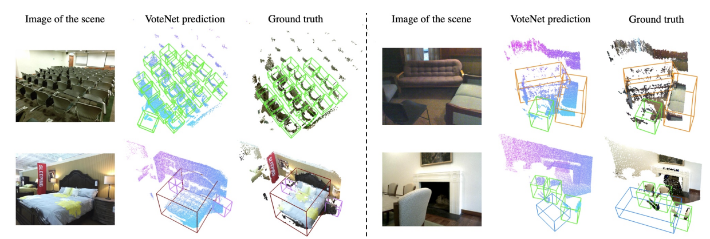

> PointNet introduced a groundbreaking approach to processing 3D point cloud data directly, bypassing the need for voxelization or other preprocessing techniques. Its core innovation lies in its ability to handle unordered point sets while maintaining permutation invariance and learning robust features for tasks such as classification and segmentation.

<!--more-->
{: class="table-of-content"}
* TOC
{:toc}
# An Overview of Point Cloud Data and Models

## Table of Contents
- [Introduction of Point Cloud](#introduction-of-point-cloud)
- [Overview of Three Papers](#overview-of-three-papers)
  - [1. Before PointNet](#1-PointNet-Deep-Learning-on-Point-Sets-for-3D-Classification-and-Segmentation)
  - [2. PointNet++](#2-PointNet-Deep-Hierarchical-Feature-Learning-on-Point-Sets-in-a-Metric-Space)
  - [3. VoteNet](#3-VoteNet-Deep-Hough-Voting-for-3D-Object-Detection-in-Point-Clouds)
- [Implementation of PointNet++ on KITTI](#implementation-of-pointnet-on-kitti)
- [Code Explorations of Pointnet and Pointnet++ on KITTI](#code-explorations-of-point-cloud-models-on-kitti)

## Introduction of Point Cloud
---
PointNet introduced a groundbreaking approach to processing 3D point cloud data directly, bypassing the need for voxelization or other preprocessing techniques. Its core innovation lies in its ability to handle unordered point sets while maintaining permutation invariance and learning robust features for tasks such as classification and segmentation.

Key Characteristics of PointNet:
Input Representation:

Directly takes raw 3D point cloud data as input, which are unordered collections of points represented by their 
(𝑥,𝑦,𝑧) coordinates.

Permutation Invariance:
PointNet uses symmetric functions, such as max-pooling, to aggregate features from individual points, ensuring that the network is invariant to the order of the input points.

Global Context Capture:
By applying shared multi-layer perceptrons (MLPs) to each point and aggregating features globally, PointNet effectively captures the overall structure of the point cloud.

## 1. Before PointNet : Voxel/Multi-View/Feature Based Methods
The field of 3D shape representation has long faced challenges due to the inherent complexities of 3D data. Traditional voxel-based methods provided an early solution by converting 3D data into regular grids, allowing the use of 3D convolutional neural networks. While effective for capturing intricate geometries and internal structures, these methods suffered from high memory usage and a loss of fine details due to discretization. Attempts to address this, such as octree-based approaches, improved memory efficiency but struggled with accurately modeling smooth surfaces.

Multi-view methods emerged as another promising approach, leveraging the success of 2D CNNs by projecting 3D shapes into multiple 2D images from various viewpoints. Although this approach enhanced computational efficiency and utilized advanced 2D image recognition techniques, it faltered when handling occluded regions or capturing the full complexity of 3D structures.

Feature-based methods, which rely on manually engineered descriptors, offered interpretability and computational simplicity. However, they were inherently limited by the representational power of handcrafted features, often failing to capture the intricate relationships within 3D data.

These limitations underscored the need for a new approach capable of directly processing raw 3D point clouds without imposing grid structures or requiring feature engineering. PointNet, introduced in 2017, addressed this gap by preserving geometric information, achieving permutation invariance, and offering a more efficient and scalable solution to 3D shape representation. It represented a significant step forward, paving the way for more sophisticated and versatile 3D architectures.

## 2. PointNet++: Deep Hierarchical Feature Learning on Point Sets in a Metric Space

### 1. Introduction

Processing point cloud data presents unique challenges due to its irregular, unordered, and sparse structure. Unlike 2D grid-based image data, point clouds lack a natural neighborhood structure, making traditional convolutional neural networks (CNNs) unsuitable. While the original **PointNet** architecture addressed some of these challenges by using symmetric functions like max pooling to handle permutation invariance, it failed to capture local structures effectively, which are crucial for tasks like segmentation and object recognition.

This paper introduces **PointNet++**, an extension of PointNet, which incorporates a hierarchical structure to learn local features at multiple scales. By grouping points into local regions using a metric space and recursively applying PointNet, PointNet++ learns both fine-grained local patterns and global contextual information. This approach achieves excellent results on various 3D learning tasks, such as object classification, part segmentation, and scene segmentation.

---

### 2. Key Contributions

- **Hierarchical Feature Learning**: PointNet++ hierarchically partitions point clouds into local regions and applies PointNet recursively to capture both local and global features.

- **Multi-Scale Grouping (MSG)**: Introduces a method to capture features at multiple scales, improving the model's ability to process point clouds with varying densities.

- **Radius-Based Sampling**: Uses a metric space approach to select neighborhoods, ensuring the local regions reflect meaningful spatial relationships.

- **Dynamic Partitioning**: Adapts the hierarchical grouping to accommodate point sets with non-uniform densities, addressing real-world variability in point cloud data.

---

### 3. Model Architecture

_This figure is an illustration of the hierarchical feature learning architecture and its application for set segmentation and classification using points in 2D Euclidean space as an example._

PointNet++ builds on the original PointNet architecture by introducing a hierarchical structure. The architecture consists of three main modules:

#### 3.1 Sampling Layer
The sampling layer reduces the number of points to be processed at each hierarchical level. It uses **farthest point sampling (FPS)** to ensure a uniform distribution of sampled points, preserving the spatial structure of the original point cloud.

#### 3.2 Grouping Layer
This layer groups the sampled points into local regions using a **radius-based neighborhood search**. The grouping process ensures that local features are computed for points that are spatially close to each other, capturing fine-grained geometric patterns.

#### 3.3 PointNet Layers
Within each local region, the original PointNet architecture is applied to learn features. The learned local features are aggregated using max pooling, ensuring permutation invariance. These features are then concatenated across scales if **multi-scale grouping (MSG)** is used, allowing the model to capture features at multiple levels of detail.

---

### 4. Training and Loss Functions

The model is trained using standard supervised learning approaches. For classification tasks, the loss function is a standard **cross-entropy loss**. For segmentation tasks, a **point-wise cross-entropy loss** is used, where each point is assigned a class label.

To prevent overfitting, data augmentation techniques such as random rotations, translations, and scaling are applied to the input point clouds. Additionally, dropout is used in the fully connected layers to improve generalization.

---

### 5. Experimental Results

PointNet++ is evaluated on several benchmark datasets for 3D point cloud learning tasks, including object classification, part segmentation, and scene segmentation.

_The figure shows that PointNet captures the overall layout of the room correctly but fails to discover the furniture. PointNet++, in contrast, is much better at segmenting objects besides the room layout._

#### Performance Metrics

| Task                  | Dataset         | Accuracy/Metric      | Improvement Over Baseline |
|-----------------------|-----------------|----------------------|---------------------------|
| Object Classification | ModelNet40      | **91.9%** (accuracy) | +2.7%                     |
| Part Segmentation     | ShapeNet Part   | **85.1%** (mIoU)     | +1.5%                     |
| Scene Segmentation    | Stanford 3D     | **57.3%** (mIoU)     | +3.8%                     |

---

### 6. Strengths and Limitations

#### Strengths
PointNet++ significantly improves over PointNet by introducing a hierarchical structure for learning local features. The use of farthest point sampling ensures that sampled points are distributed uniformly, preserving the overall geometry of the point cloud. The ability to handle varying point densities through multi-scale grouping makes it robust to real-world data variability. Additionally, its simplicity and efficiency allow it to be applied to large-scale datasets.

#### Limitations
The reliance on radius-based grouping can lead to inefficiencies for very dense point clouds, as the neighborhood search can become computationally expensive. Furthermore, the hierarchical structure introduces additional complexity compared to the original PointNet and requires careful tuning of hyperparameters like radius size and group count. The model also struggles with very sparse point clouds, where local neighborhoods may not contain enough points to extract meaningful features. Lastly, it does not incorporate contextual information from other data modalities, such as RGB images, which could further enhance its performance.

---

## 3. VoteNet: Deep Hough Voting for 3D Object Detection in Point Clouds

### 1. Introduction

Point clouds are sparse, unordered, and irregular, making them challenging to process with traditional methods. These unique characteristics require specialized approaches for accurate object detection and localization. Previous methods, such as Frustum PointNets and VoteNet, were designed to address these challenges but often struggled in cluttered, occluded, or sparse environments.

This paper introduces a novel framework called **Deep Hough Voting**, inspired by the Hough Transform. The core idea is to allow each point in a 3D point cloud to "vote" for the potential center of an object. By aggregating these votes, the framework generates robust object localization hypotheses, even under challenging conditions such as occlusions or noise. Unlike traditional methods, the voting mechanism is designed to be learnable and fully integrated into an end-to-end training pipeline, enhancing both efficiency and accuracy.

---

### 2. Key Contributions

- **Deep Hough Voting**: a learnable voting module that allows each point in the point cloud to predict potential object center offsets. This helps localize objects even in incomplete or occluded scenes. PointNet++, in contrast, does not have an explicit mechanism for aggregating evidence toward object centers.

- **Learnable Vote Aggregation**: A clustering mechanism that groups votes based on spatial proximity to identify high-confidence object centers. In contrast, PointNet++ uses predefined radius-based grouping, which may not adapt well to varying densities.

- **Global Object Localization**: By clustering votes, the model aggregates local evidence to form global object hypotheses, making it robust to sparse and occluded data. In comparison,PointNet++ lacks such a mechanism and only focuses on feature extraction.

- **Hierarchical Feature Learning**: The integration of PointNet++ for extracting rich geometric and contextual features from raw point cloud data.

- **State-of-the-Art Performance**: Significant improvements over previous methods on benchmark datasets, demonstrating the robustness of the approach.

---

### 3. Model Architecture

_The above figure is an illustration of the VoteNet architecture for 3D object detection in point clouds. Given an input point cloud of N points with XYZ coordinates, a backbone network (implemented with PointNet++ layers) subsamples, learns deep features on the points, and outputs a subset of M points but extended by C-dim features. This subset of points is considered as seed points. Each seed independently generates a vote through a voting module. Then the votes are grouped into clusters and processed by the proposal module to generate the final proposals. The classified and NMSed proposals become the final 3D bounding boxes output._

The proposed model is composed of three key components: a feature extraction network, a voting module, and an object proposal network.

1. **Point Feature Extraction**  
   The feature extraction module is based on **PointNet++**, which processes raw, unordered point clouds to extract hierarchical features. PointNet++ operates by grouping neighboring points into local regions and applying feature aggregation operations. This design enables the network to capture both fine-grained geometric details and global contextual information.

2. **Voting Module**  
   The voting module is the core innovation of the framework. Each point predicts offsets to potential object centers. These offsets, represented as $\text{Vote Position} = \text{Point Position} + (\Delta x, \Delta y, \Delta z)$, are added to the original point coordinates to generate votes. Each vote is also associated with a confidence score indicating its likelihood of being a valid object center. Votes from different points are then aggregated in a spatially consistent manner.

4. **Vote Clustering and Object Proposals**  
   After votes are generated, they are clustered based on their spatial proximity using a learnable clustering mechanism. High-confidence vote clusters correspond to potential object centers. From these clusters, the object proposal network generates 3D bounding boxes and predicts semantic labels for each detected object.

---

### 4. Training and Loss Functions

The network is trained end-to-end using a combination of carefully designed loss functions:
- **Voting Loss**: Encourages accurate prediction of offsets between input points and ground truth object centers, defined as:

- **Objectness Loss**: Classifies each point as belonging to an object or the background.
- **Bounding Box Regression Loss**: Refines the predicted bounding boxes by minimizing the difference between the predicted and ground truth dimensions.

#### Data Augmentation
The authors use techniques such as random rotations, translations, and cropping to improve robustness. These augmentations help the model generalize better to unseen environments and mitigate overfitting.

---
## Implementation of PointNet++ on KITTI

### 5. Experimental Results

_Both left and right panels show (from left to right): an image of the scene, 3D object detection by VoteNet, and ground-truth annotations._ 

The method was evaluated on the **SUN RGB-D** and **ScanNet** datasets, two widely used benchmarks for 3D object detection. **SUN RGB-D** features diverse indoor scenes with challenging occlusions and clutter, while **ScanNet** consists of dense reconstructions of indoor spaces.

#### Performance Metrics
- Mean Average Precision (mAP) at IoU thresholds of 0.25 and 0.5 was used to evaluate the model.

| Dataset      | Metric     | VoteNet           | BoxNet        | Frustum PointNets |
|--------------|------------|-------------------|---------------|-------------------|
| SUN RGB-D    | mAP@0.25   | **57.7%**         | 53.0%         | 51.2%             |
| ScanNet      | mAP@0.25   | **58.6%**         | 45.4%         | 40.5%             |

---

### 6. Strengths and Limitations

#### Strengths
The Deep Hough Voting framework offers several strengths that set it apart in 3D object detection tasks. Its has strong ability to handle sparse and occluded data, as the learnable voting mechanism allows points to infer object centers even when portions of the object are missing. The integration with PointNet++ enables it to capture both local geometric features and global context, which is crucial for 3D scene understanding. Additionally, its end-to-end trainability ensures that all components—feature extraction, voting, and proposal generation—are optimized together. The framework achieves state-of-the-art results on benchmarks such as SUN RGB-D and ScanNet and is effective in indoor environments with clutter and occlusion.

#### Limitations
The vote clustering mechanism introduces computational overhead, making it less suitable for real-time applications or large-scale point clouds. While it performs well in sparse and occluded data, its efficiency decreases with dense point clouds where excessive votes can lead to clustering inefficiencies. The reliance on PointNet++ may also limit its ability to fully capture long-range relationships between points. Furthermore, the method has been primarily tested on indoor datasets and it's not sure how it can be generalized to outdoor scenarios, such as in autonomous driving. Finally, the absence of multi-modal integration means it does not leverage additional data sources such as RGB images, which could potentially enhance its performance in challenging situations.

---

### 7. Further Works

Multi-Modal Integration:
Extend VoteNet by fusing point cloud data with RGB images (e.g., via a transformer-based fusion mechanism) to improve object detection in complex environments, as explored in PV-RCNN for autonomous driving.

Lightweight Architectures:
Develop a simplified version of PointNet++ that uses voxel-based approximations for initial feature extraction (e.g., Minkowski Engine) to reduce computation costs while retaining hierarchical feature learning.

Handling Temporal Data:
Incorporate recurrent layers or temporal transformers into PointNet++ to process sequential point cloud data for tasks like 3D action recognition or tracking objects over time.

Generalization to Outdoor Environments:
Modify VoteNet to handle large-scale, sparse datasets like KITTI by introducing global-local attention mechanisms to better capture long-range dependencies.
Augmented Supervision:

## Code Explorations of Pointnet and Pointnet++ on KITTI

Our Google Colab containing an existing implementation of Pointnet and our own Pointnet++ implementation from scratch using PyTorch can be found in the link below. We provide sample train, test, and validation code for both Pointnet and Pointnet++ on the KITTI dataset obtained from Kaggle. 

Link to code: https://colab.research.google.com/drive/1b2yyaaWzeot0D8BrKng59TZfZrlnp8a5?usp=sharing 

